# Emergency CRL Signing from a Secondary Issuing CA with an nShield HSM

This runbook explains how to keep a Certificate Revocation List (CRL) valid when the issuing Certification Authority (CA) that owns it is down. A second issuing CA server that uses the same Entrust nShield Security World signs a fresh copy of the CRL with the primary CA's key and certificate. It is written for PKI administrators and HSM operators who run Microsoft Active Directory Certificate Services (AD CS).

## Overview

Every CRL has a Next Update date. After that date, clients treat the CRL as expired. Many applications then fail revocation checks, and services such as smart card logon, VPN, Wi-Fi (802.1X) and TLS client authentication can stop working.

If the primary issuing CA server is down and cannot be repaired before Next Update, a CRL can still be produced. The CRL signature only needs the CA's private key and certificate. When both CA servers use the same nShield Security World, the primary CA's key blob can be loaded on the secondary server. The secondary server then uses `certutil -sign` to re-sign the last published CRL with new dates.

Example names used in this article:

| Item | Example value |
|---|---|
| Primary issuing CA (down) | Contoso-Issuing-CA-01 on server ICA01 |
| Secondary issuing CA (healthy) | Contoso-Issuing-CA-02 on server ICA02 |
| Root CA | Contoso-Root-CA |
| Primary CA certificate serial number | `<PrimaryCASerial>` |

> **Note:** Screenshots are from a lab environment. Names in the screenshots differ from the example names in the text.

## Applies to

- Microsoft AD CS enterprise or standalone issuing CAs on Windows Server 2016, 2019, 2022 and 2025.
- Entrust nShield HSMs using the CNG provider "nCipher Security World Key Storage Provider".
- CA keys protected by module protection, or by an Operator Card Set (OCS) that is available on site.

## Prerequisites

- Both CA servers are enrolled in the **same nShield Security World**, and the HSM used by ICA02 is loaded in that world (check with `enquiry` and `nfkminfo`).
- The primary CA key is **module protected**, or the OCS that protects it (quorum K of N cards and passphrases) is available. A softcard-protected key also needs the softcard file and passphrase.
- Local Administrator rights on ICA02, and read access to the primary CA's files (or to a recent backup of them).
- The primary CA's CRL validity settings. Run these on the primary CA, or read them from a registry backup:

```cmd
certutil -getreg CA\CRLPeriodUnits
certutil -getreg CA\CRLPeriod
```

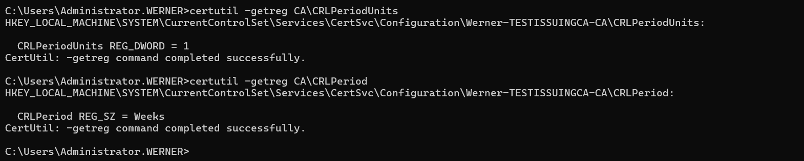

- The serial number of the primary CA certificate. Open the CA certificate, select the **Details** tab and copy **Serial number**.

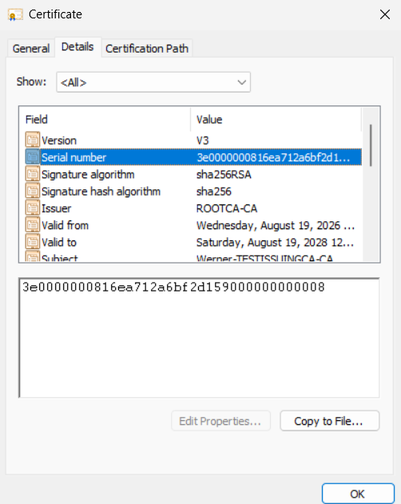

- The last base CRL that the primary CA published (from the CRL Distribution Point (CDP) web server, LDAP, or `%windir%\System32\CertSrv\CertEnroll` on the primary). Open it and note **Effective date**, **Next update** and **CRL Number**.

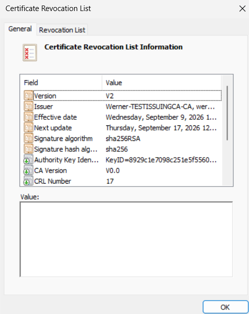

- The last delta CRL, if the CA publishes delta CRLs. Any certificate revoked after the last base CRL appears only in the delta CRL (see Step 7).

## Before starting

- **Get approval.** Copying a CA key blob to another server changes where the CA key can be used. Record the decision under the incident or change process and check the Certificate Policy (CP) and Certification Practice Statement (CPS).
- **Pick a short validity.** The emergency CRL should cover only the expected outage, for example 7 days. It must not run past the date when the primary CA is expected back.
- **Confirm the key files exist.** On each server, the Security World files live in `C:\ProgramData\nCipher\Key Management Data\local`. The CA key blob name starts with `key_caping_machine--`.

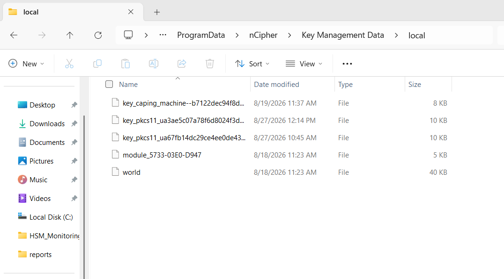

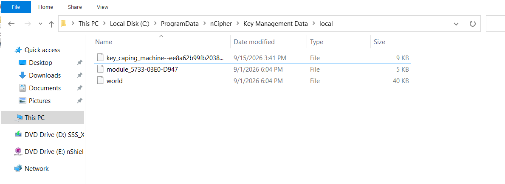

> **Warning:** The key blob is encrypted by the Security World and cannot be used outside it. It is still a copy of a CA key. Track every copy and remove it after the event.

## Procedure

### Phase 1: Prepare the secondary server

1. **Export the primary CA certificate.** On ICA01 (or from the AIA location or a backup), export the CA certificate as a `.cer` file and copy it to ICA02.
2. **Add the certificate to the local computer Personal store on ICA02.**

```cmd
certutil -addstore My Contoso-Issuing-CA-01.cer
```

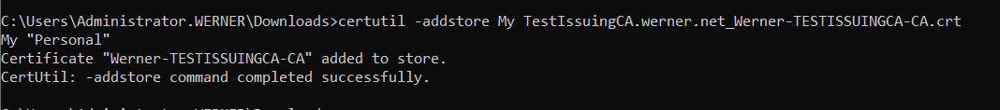

### Phase 2: Identify and copy the key blob

3. **Find the CA key name.** On the primary server (or any server holding the primary's Key Management Data), run:

```cmd
cd "%NFAST_HOME%\bin"
enquiry
nfkminfo --name-list
```

`enquiry` is optional and confirms the HSM is in the operational state. `nfkminfo --name-list` lists keys with their names. The CA key appears as `key_caping_machine--<hash>` followed by the CA name.

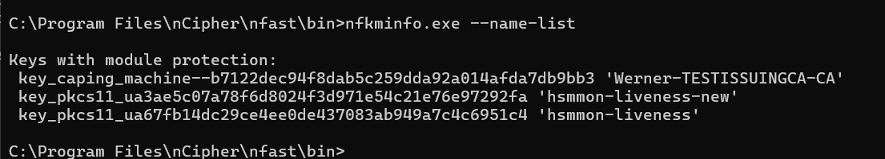

4. **Copy the key blob.** On the primary server, open `C:\ProgramData\nCipher\Key Management Data\local` and copy the file `key_caping_machine--<hash>` that matches Step 3.

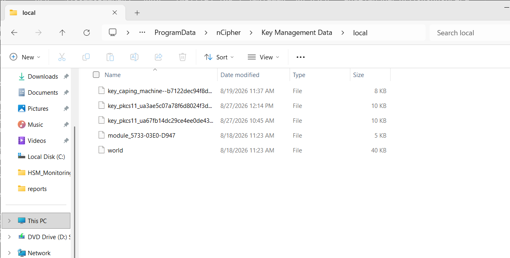

5. **Paste it on ICA02** in the same folder, `C:\ProgramData\nCipher\Key Management Data\local`. Do not overwrite ICA02's own `key_caping_machine` file.

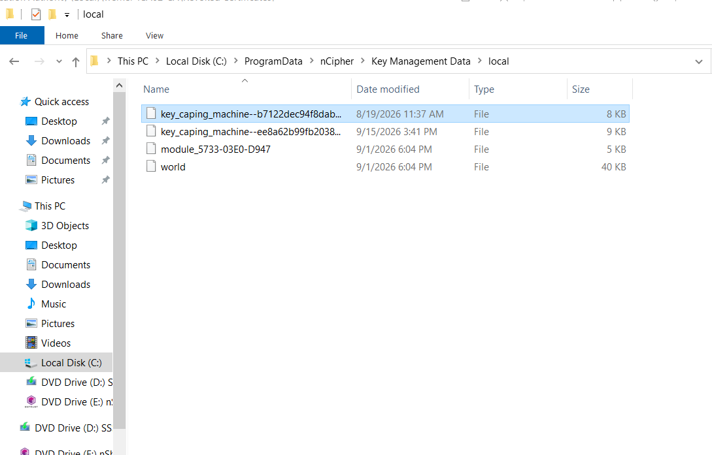

> **Tip:** With an nShield Connect and a Remote File System (RFS), the blob may already be on the RFS. Running `rfs-sync --update` on ICA02 pulls it down. Verify against the vendor documentation for the installed version.

### Phase 3: Bind and verify the key

6. **Bind the certificate to the key.** On ICA02, run:

```cmd
certutil -f -csp “nCipher Security World Key Storage Provider” -repairstore My “<Serial Number from previous step>”
```

The output should show the key container, `Provider = nCipher Security World Key Storage Provider`, and `Signature test passed`. If the key is OCS protected, the command waits for the card set and passphrase.

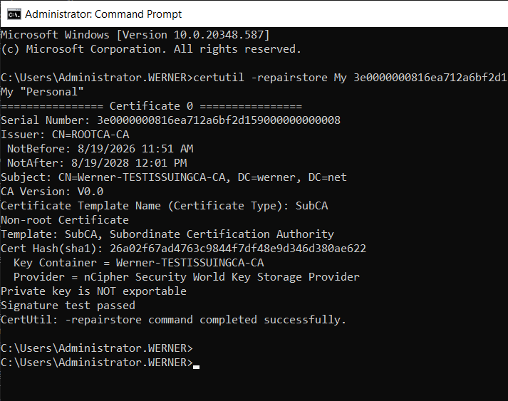

7. **Verify the binding.** Run either command:

```cmd
certutil -verifystore -v My <PrimaryCASerial>
certutil -store My <PrimaryCASerial>
```

Confirm the nCipher provider is listed, the private key is present, `Signature test passed` appears, and the chain ends with `Certificate is valid`.

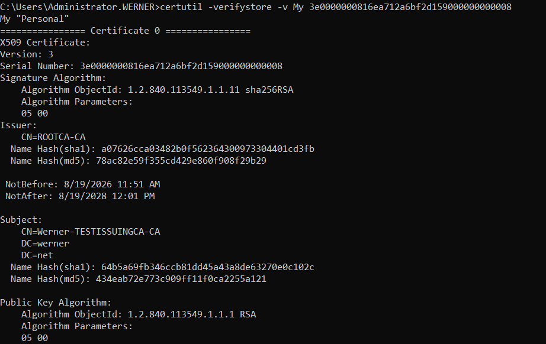

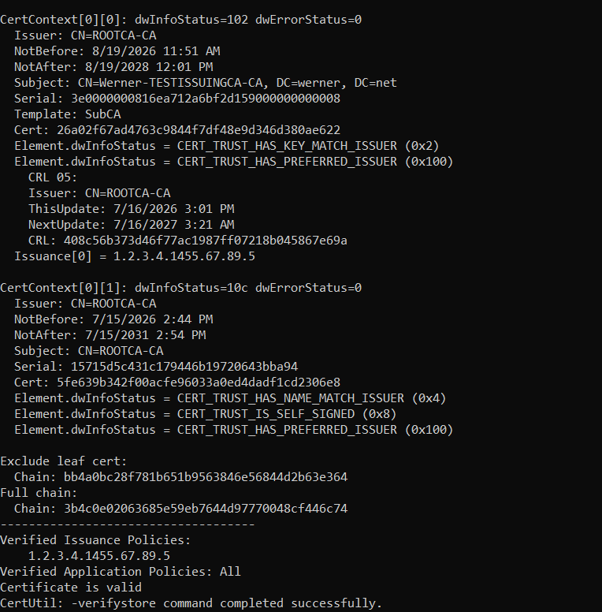

### Phase 4: Sign and publish the emergency CRL

8. **Save the last published base CRL** on ICA02, for example as `Contoso-Issuing-CA-01.crl`.

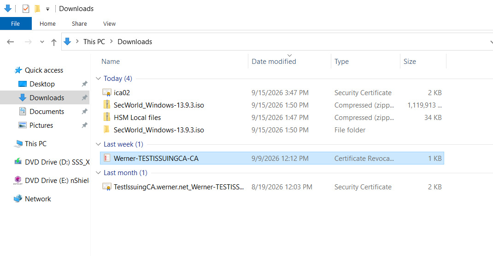

9. **Check for revocations that only exist in the delta CRL.** Run `certutil -dump <delta>.crl` and list the serial numbers. Any certificate that must be revoked during the outage also goes on this list.

10. **Re-sign the CRL.** The time argument uses the format `now+dd:hh` (days and hours). `now+7:00` means 7 days and 0 hours from now. `now+14:00` means 14 days, not 14 hours.

```cmd
certutil -sign Contoso-Issuing-CA-01.crl emergency.crl now+7:00 -2.5.29.46
```

To also add serial numbers from Step 9, append them with a plus sign:

```cmd
certutil -sign Contoso-Issuing-CA-01.crl emergency.crl now+7:00 -2.5.29.46 +<Serial1>,<Serial2>
```

The minus sign removes the listed extension. OID 2.5.29.46 is the **Freshest CRL** extension. In a base CRL it points clients to the delta CRL. Removing it stops clients from looking for a delta CRL that the primary CA can no longer publish. (OID 2.5.29.27 is the **Delta CRL Indicator**. It appears only inside delta CRLs, so it is not present in a base CRL.)

11. **Pick the signing certificate.** In the **Certificate List** dialog, select the primary CA certificate (Contoso-Issuing-CA-01, issued by Contoso-Root-CA), not ICA02's own certificate, then select **OK**.

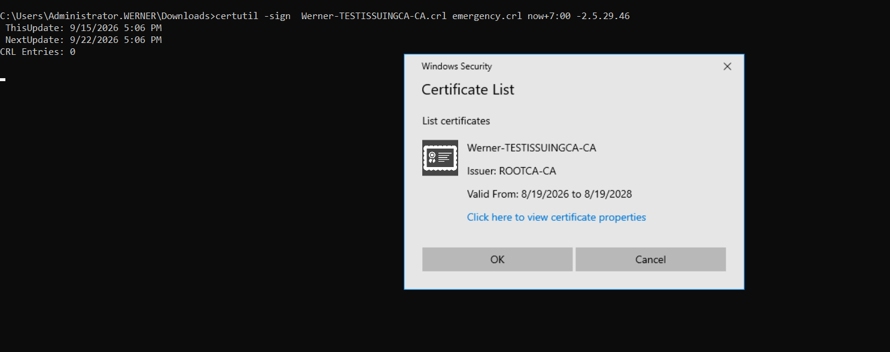

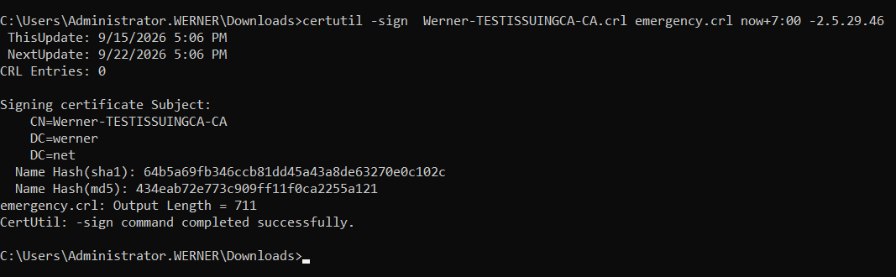

12. **Rename and publish.** Rename `emergency.crl` to the exact file name used in the CDP URLs (for example `Contoso-Issuing-CA-01.crl`). Copy it to every HTTP CDP location. If the CA uses an LDAP CDP, publish it to Active Directory with the primary CA's host name:

```cmd
certutil -dspublish -f Contoso-Issuing-CA-01.crl ICA01
```

## Verification

1. Dump the new CRL and check the fields:

```cmd
certutil -dump Contoso-Issuing-CA-01.crl
```

Confirm **Issuer** is the primary CA, **This Update** is now, **Next Update** matches the chosen period, and the Freshest CRL extension is gone. `certutil -sign` keeps the original **CRL Number**.

2. Download the CRL from each CDP URL and confirm it is the new file.
3. On a client, test a certificate issued by the primary CA:

```cmd
certutil -verify -urlfetch <IssuedCert>.cer
```

The CRL check for each CDP should report "Verified".

## Rollback and cleanup

1. When ICA01 is back, publish a new CRL right away with `certutil -CRL`. Its CRL Number is higher than the emergency CRL.
2. On ICA02, delete the primary CA certificate from the Personal store (`certutil -delstore My <PrimaryCASerial>`).
3. Delete the copied `key_caping_machine--<hash>` file from ICA02. Do not delete ICA02's own key file. On an RFS, keep the blob only where it belongs.
4. Record the event: time, approvers, CRL validity used, serial numbers added, and cleanup evidence.

## Troubleshooting

| Symptom | Likely cause | Resolution |
|---|---|---|
| `-repairstore` shows no private key or a key-not-found error | Key blob not in `kmdata\local`, or wrong file copied | Re-check Step 3, copy the matching blob, rerun. Optionally add `-csp "nCipher Security World Key Storage Provider"`. |
| `-repairstore` seems to hang | OCS or softcard prompt waiting, or HSM busy | Insert the OCS cards and enter the passphrase. Check `enquiry` for module state before stopping the command with Ctrl+C. |
| Signature test fails | ICA02 HSM not in the same Security World | Compare `nfkminfo` world hash on both servers. Enroll the module in the correct world. |
| Wrong certificate offered in the dialog | Several CA certificates in the Personal store | Select the primary CA certificate, or add `-Cert <PrimaryCASerial>` to the `-sign` command. |
| Clients still report revocation offline | CDP not updated or client cache | Check each URL, then run `certutil -urlcache * delete` and `certutil -setreg chain\ChainCacheResyncFiletime @now` on test clients. |
| Delta CRL errors after emergency CRL | Freshest CRL not removed | Re-sign with `-2.5.29.46`. |

## Related articles

- [Recovering from an Expired CRL](recovering-from-an-expired-crl.md)
- [Changing CRL Publication Periods](changing-crl-publication-periods.md)
- [certutil Command Reference](certutil-command-reference.md)
- [High Availability CDP and AIA](high-availability-cdp-and-aia.md)
- [Entrust nShield Security World Concepts](../../02-General/HSM/entrust-nshield-security-world-concepts.md)
- [CRL vs OCSP](../../02-General/PKI/crl-vs-ocsp.md)
